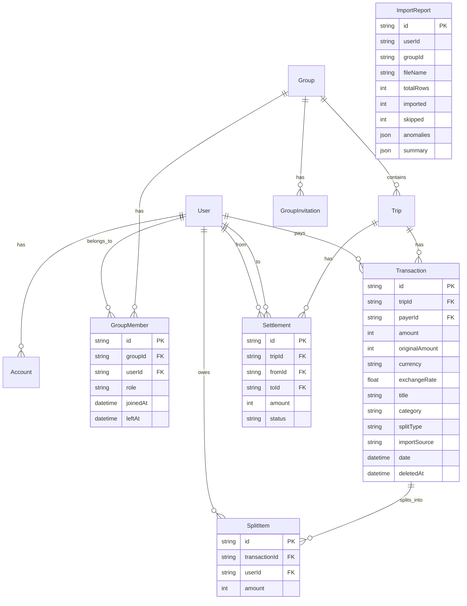

# SCOPE.md — Anomaly Log & Database Schema

## Overview

This document catalogs every data problem found in `expenses_export.csv` and explains how the import engine handles each one. Our approach: **detect everything, surface everything, let the user decide**.

---

## Data Anomalies Detected (15)

### 🔴 ERRORS (Critical — rows may be skipped)

| # | Type | Row(s) | Description | Policy |
|---|------|--------|-------------|--------|
| 1 | **MISSING_AMOUNT** | 29 | "Groceries - Blinkit" has no amount | **Skip** — cannot import without a valid amount. User can add manually after import. |
| 2 | **ZERO_AMOUNT** | 26 | "Groceries" with ₹0 amount | **Skip** — zero-amount entries have no financial effect and are likely data entry errors. |
| 3 | **DUPLICATE_EXACT** | 10, 41 | "Groceries - Zepto" appears twice with identical date, description, and amount | **Remove duplicate** — keep first occurrence (row 10), skip row 41. |

### 🟡 WARNINGS (Need user review)

| # | Type | Row(s) | Description | Policy |
|---|------|--------|-------------|--------|
| 4 | **DUPLICATE_ENTRY** | 5, 6 | "Dinner at Mainland China" (₹3,200) vs "Mainland China Dinner" (₹3,400) — same date, different amounts, different payers | **User decides** which amount is correct, or whether to keep both (e.g., separate bills). |
| 5 | **NEGATIVE_AMOUNT** | 11 | "Returned Bottles Deposit" with -₹500 | **Treat as refund** — reverse split direction (money flows back to participants). Flagged for review. |
| 6 | **SETTLEMENT_AS_EXPENSE** | 22 | "Rohan paid Priya" (₹3,000) — category is "Settlement" | **Import as settlement**, not expense. Detects via keywords ("paid") + category ("Settlement"). |
| 7 | **FOREIGN_CURRENCY** | 14, 16 | Scuba Diving ($45), Jet Ski ($60) — trip expenses in USD | **Convert to INR** at ₹83.50/USD. Show both original and converted amounts. User can adjust rate. |
| 8 | **POST_DEPARTURE_MEMBER** | 27 | April electricity bill includes Meera, who left March 31 | **Flag for removal** — Meera shouldn't be in post-March splits. User confirms. |
| 9 | **MEMBER_IN_WRONG_TRIP** | 13 | Goa Hotel split includes Meera, but she wasn't on the trip (Dev was) | **Flag for review** — if Meera didn't go on the trip, remove from split. |
| 10 | **AMBIGUOUS_DATE** | 10 | "03/05/2025" — is this March 5 or May 3? | **Default DD/MM/YYYY** (Indian convention). User can override if wrong. |
| 11 | **NAME_INCONSISTENCY** | 30 | "priya" (lowercase) vs "Priya" (capitalized) | **Auto-normalize** to Title Case. Flagged for transparency. |

### 🔵 INFO (Auto-fixed, logged)

| # | Type | Row(s) | Description | Policy |
|---|------|--------|-------------|--------|
| 12 | **WHITESPACE_IN_NAME** | 6, 25 | " Rohan" and " Aisha " have leading/trailing spaces | **Auto-trim** whitespace. Logged in report. |
| 13 | **MISSING_CURRENCY** | 1,3,7,10+ | Rows without a currency field | **Default to INR**. Logged in report. |
| 14 | **INCONSISTENT_DATE_FORMAT** | 4,6 | "15/02/2025" (DD/MM/YYYY) and "18-02-2025" (DD-MM-YYYY) vs ISO format | **Auto-detect and convert**. Multiple format parsers with heuristic matching. |
| 15 | **PRE_JOIN_MEMBER** | — | Sam included before their join date | **Flag for review** if detected. |

---

## Detection Methods

### Duplicate Detection
- **Exact duplicates**: Same date + identical description + same amount → flag second occurrence
- **Similar duplicates**: Same date + description similarity > 60% (Dice coefficient) + amounts within 10% → flag for review

### Settlement Detection
Keywords scanned in description: `paid`, `settled`, `settlement`, `repaid`, `returned money`, `gave back`, `transferred`, `sent money`, `reimbursed`
Additionally checks if category field equals "settlement" (case-insensitive).

### Date Parsing Strategy
1. Try ISO format (YYYY-MM-DD) first
2. For slash-separated dates:
   - If first number > 12 → must be DD/MM/YYYY
   - If second number > 12 → must be MM/DD/YYYY  
   - If both ≤ 12 → ambiguous → default DD/MM/YYYY (Indian convention), flag for user
3. For dash-separated dates: assume DD-MM-YYYY
4. Fallback: JavaScript native Date parser

### Name Normalization
1. Trim whitespace
2. Case-insensitive matching (Map<lowercase, canonical>)
3. First occurrence sets canonical form (Title Case)

### Temporal Membership Validation
Pre-configured member timelines:
| Member | Joined | Left |
|--------|--------|------|
| Aisha | Feb 1 | — (active) |
| Rohan | Feb 1 | — (active) |
| Priya | Feb 1 | — (active) |
| Meera | Feb 1 | Mar 31 |
| Dev | Mar 10 | Mar 12 (trip only) |
| Sam | Apr 15 | — (active) |

---

## Database Schema

### Entity-Relationship Diagram

### Key Design Decisions in Schema

1. **All amounts in paise (integer)** — avoids floating-point errors entirely
2. **`originalAmount` + `currency` + `exchangeRate`** on Transaction — preserves foreign currency info
3. **`leftAt` on GroupMember** — enables temporal membership validation
4. **`importSource` on Transaction** — tracks which rows came from CSV import
5. **`ImportReport` model** — stores full anomaly report for each import operation
6. **Soft deletes** — `deletedAt` fields allow undo without data loss
