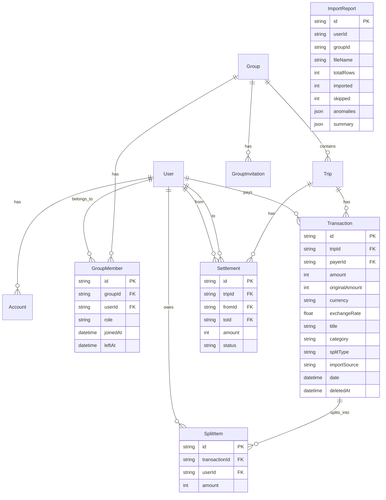

# SCOPE.md — Anomaly Log & Database Schema

## Overview

This document catalogs every data problem found in `expenses_export.csv` and explains how the import engine handles each one. Our approach: **detect everything, surface everything, let the user decide**.

---

## Data Anomalies Detected (15)

### 🔴 ERRORS (Critical — rows may be skipped)

| # | Type | Row(s) | Description | Policy |
|---|------|--------|-------------|--------|
| 1 | **MISSING_PAYER** | 13 | "House cleaning supplies" has no payer field | **Skip** — cannot import without knowing who paid. |
| 2 | **ZERO_AMOUNT** | 31 | "Dinner order Swiggy" with ₹0 amount | **Skip** — zero-amount is a data entry placeholder (note says "counted twice earlier"). |
| 3 | **DUPLICATE_EXACT** | 5, 6 | "Dinner at Marina Bites" and "dinner - marina bites" — same date, same amount (₹3,200), same payer (Dev) | **Exact duplicate** — keep first occurrence (row 5), flag row 6 for removal. |

### 🟡 WARNINGS (Need user review)

| # | Type | Row(s) | Description | Policy |
|---|------|--------|-------------|--------|
| 4 | **SETTLEMENT_AS_EXPENSE** | 14 | "Rohan paid Aisha back" (₹5,000) — note says "this is a settlement not an expense??" | **Import as settlement**, not expense. |
| 5 | **FOREIGN_CURRENCY** | 20, 21, 23, 26 | Goa villa ($540 USD), Beach shack ($84 USD), Parasailing ($150 USD), Refund (-$30 USD) | **Convert to INR** at ₹83.50/USD. Show both original and converted. |
| 6 | **NEGATIVE_AMOUNT** | 26 | "Parasailing refund" with -$30 USD | **Treat as refund/credit** — reverse split direction. |
| 7 | **POST_DEPARTURE_MEMBER** | 36 | April groceries includes Meera — note says "oops Meera still in the group list" | **Flag for removal** — Meera moved out end of March. |
| 8 | **AMBIGUOUS_DATE** | 34 | "04-05-2026" — is this April 5 or May 4? Note explicitly says "format is a mess" | **Default DD/MM/YYYY** (Indian convention = 4 May). User can override. |
| 9 | **SPLITS_DONT_SUM** | 15 | Pizza Friday: Aisha 30% + Rohan 30% + Priya 30% + Meera 20% = **110%** (not 100%) | **Flag for review** — percentages don't add up. |
| 10 | **DUPLICATE_ENTRY** | 24, 25 | "Dinner at Thalassa" (₹2,400 by Aisha) and "Thalassa dinner" (₹2,450 by Rohan) — same date, similar desc | **User decides** which is correct (note says "Aisha also logged this"). |
| 11 | **MEMBER_IN_WRONG_TRIP** | 23 | Parasailing includes "Dev's friend Kabir" — unknown external member on a shared expense | **Flag for review** — Kabir is not a regular member; should he share costs? |

### 🔵 INFO (Auto-fixed, logged)

| # | Type | Row(s) | Description | Policy |
|---|------|--------|-------------|--------|
| 12 | **INCONSISTENT_DATE_FORMAT** | 27 | `Mar-14` — month-abbreviation format with no year | **Auto-parse** as 14 March (inferred year), flag for user to confirm. |
| 13 | **MISSING_CURRENCY** | 28 | "Groceries DMart" (Mar 15) has empty currency field | **Default to INR**. Logged in report. |
| 14 | **NAME_INCONSISTENCY** | 9, 11 | `priya` (lowercase) and `Priya S` vs `Priya` — same person, different names | **Auto-normalize** to Title Case canonical form. |
| 15 | **WHITESPACE_IN_NAME** | 27 | `rohan ` (trailing space in payer field) | **Auto-trim** whitespace. Logged. |

---

## Detection Methods

### Duplicate Detection
- **Exact duplicates**: Same date + identical or near-identical description + same amount + same payer → flag second occurrence
- **Similar duplicates**: Same date + description similarity > 60% (Dice coefficient) + amounts within 10% → flag for user review

### Settlement Detection
Keywords scanned in description: `paid`, `settled`, `settlement`, `repaid`, `returned money`, `gave back`, `transferred`, `sent money`, `reimbursed`  
Also checks if category field equals "settlement" (case-insensitive).

### Date Parsing Strategy
1. Try ISO format (YYYY-MM-DD) first
2. For slash-separated dates:
   - If first number > 12 → must be DD/MM/YYYY
   - If second number > 12 → must be MM/DD/YYYY  
   - If both ≤ 12 → ambiguous → default DD/MM/YYYY (Indian convention), flag for user
3. For dash-separated dates: assume DD-MM-YYYY
4. For month-abbreviation format (e.g. `Mar-14`): parse month name + day, infer year, flag for user
5. Fallback: JavaScript native Date parser

### Name Normalization
1. Trim whitespace
2. Case-insensitive matching (Map<lowercase, canonical>)
3. First occurrence sets canonical form (Title Case)
4. Handles both comma-separated and **semicolon-separated** member lists

### CSV Format Compatibility
The parser auto-detects column names and supports **two CSV formats**:
| Field | Old Format | New Format |
|-------|-----------|------------|
| Split members | `Split Among` (comma-separated) | `split_with` (semicolon-separated) |
| Split type | *(absent)* | `split_type` (equal/unequal/percentage/share) |
| Split details | *(absent)* | `split_details` (e.g. "Rohan 700; Priya 400") |
| Category | `Category` column | *(absent — defaults to `general`)* |

### Temporal Membership Validation
Member timelines are inferred dynamically from the CSV data itself (first/last seen dates), rather than hardcoded. This makes the parser work correctly for both 2025 and 2026 dated CSVs.

| Member | Role |
|--------|------|
| Aisha | Core flatmate |
| Rohan | Core flatmate |
| Priya | Core flatmate |
| Meera | Left end of March |
| Dev | Guest (Goa trip only) |
| Sam | Moved in mid-April |

---

## Database Schema

### Entity-Relationship Diagram

### Key Design Decisions in Schema

1. **All amounts in paise (integer)** — avoids floating-point errors entirely
2. **`originalAmount` + `currency` + `exchangeRate`** on Transaction — preserves foreign currency info
3. **`leftAt` on GroupMember** — enables temporal membership validation
4. **`importSource` on Transaction** — tracks which rows came from CSV import
5. **`ImportReport` model** — stores full anomaly report for each import operation
6. **Soft deletes** — `deletedAt` fields allow undo without data loss
